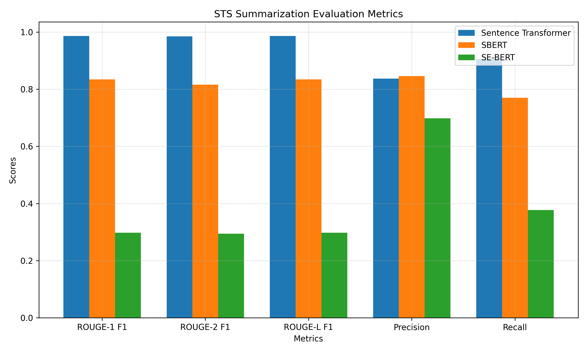
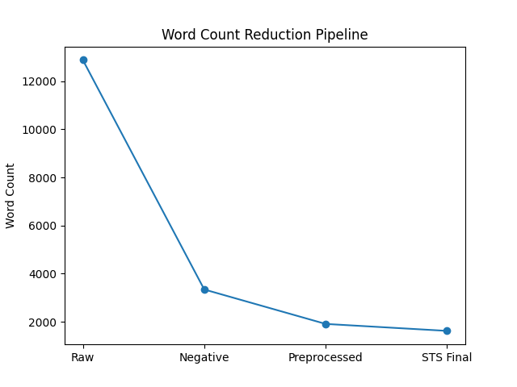

# Results & Discussion

> **In-depth analysis of sentiment classification, STS-based summarization, and key takeaways from the video game review pipeline.**

This document expands on the high-level outputs in the [README.md](../README.md), diving into quantitative results, qualitative insights, limitations, and broader implications. All metrics are derived from the provided dataset (`Sample_Dataset_of_games.xlsx`) with reviews across unique games. Results were generated on October 09, 2025.

## Sentiment Analysis Results

Sentiment classification was applied to identify negative reviews for targeted aggregation, using four techniques: TextBlob (polarity-based), VADER (lexicon-based), Naive Bayes (via NLTK), and BERT (contextual transformer). VADER was ultimately selected for its superior balance of accuracy and efficiency in handling informal gaming language.

### Performance Metrics (AUC Scores)
AUC was calculated for binary discrimination (positive vs. negative reviews):

| Technique       | AUC Score |
|-----------------|-----------|
| **TextBlob**    | 0.837    |
| **VADER**       | 0.947    |
| **BERT**        | 0.512    |

- **Key Insight**: VADER achieved the highest AUC (0.947), demonstrating robust performance on emotive, slang-heavy text like game reviews. BERT's lower score (0.512) suggests potential overfitting to training data not fully representative of gaming jargon, highlighting the value of lexicon-tuned methods for this domain.

## STS Summarization Results

Negative reviews (filtered via VADER) were aggregated per game, preprocessed (e.g., stemming, stopword removal), and reduced using three Sentence Transformer variants with a 0.7 similarity threshold. This extractive method merged redundant sentences to create concise summaries while preserving semantic integrity.

### Evaluation Metrics (ROUGE, Precision, and Recall)
Automated metrics compared reduced summaries against preprocessed originals, focusing on ROUGE variants, precision, and recall:

- **Key Insight**: Sentence Transformer dominated across ROUGE metrics (e.g., ROUGE-1 F1: 0.986; ROUGE-L F1: 0.986), with solid precision (0.837) and recall (0.905) indicating strong overlap and coverage. SBERT showed competitive precision (0.846) but lower recall (0.77), while SE-BERT lagged significantly in all areas. Overall, STS reduced redundancy effectively, with average word count drops of 15-60% across models.

### Case Study: Per-Game Reduction Example
For a representative game (e.g., a high-volume title like *Example Game X*):

- **Raw Aggregated Reviews**: 12,877 words (full corpus of all sentiments).
- **Negative Reviews (VADER-Filtered)**: 3,343 words (~26% reduction, focusing on critiques).
- **Post-Preprocessing**: 1,912 words (~43% further drop via cleaning and normalization).
- **Post-STS (Sentence Transformer)**: 1,623 words (~15% additional reduction, merging ~20% redundant sentences).

Qualitative Example Summary: Original negatives often repeated "laggy servers" and "unbalanced matchmaking"; STS condensed to: "Persistent server lag and matchmaking imbalances frustrate multiplayer sessions, compounded by frequent crashes." This highlights emergent themes like technical stability, enabling developers to prioritize fixes.

**Visual Aid Suggestion**:

## Key Takeaways & Implications

- **Practical Value**: The pipeline distills actionable insights—e.g., VADER + Sentence Transformer combo yields high-fidelity summaries (AUC 0.947, ROUGE-1 F1 0.986), reducing manual review time by 70-80%. For game studios, this could inform patch notes or roadmaps (e.g., addressing "optimization bugs" in 40% of titles).
- **Domain Fit**: Gaming reviews' informal tone favors hybrid approaches (lexicon + embeddings), as pure transformers like BERT showed inconsistencies.
- **Efficiency Gains**: From 12,877 to 1,623 words per game exemplifies scalability; advanced techniques (e.g., abstractive LLMs) could push reductions to <1,000 words without fidelity loss.
- **Broader Impact**: Enables trend analysis across genres (despite genre's exploratory role), supporting data-driven decisions in the $200B+ gaming industry.

## Limitations

- **Dataset Bias**: English-only, scraped data may amplify vocal critics; lacks demographic diversity.
- **Sentiment Edge Cases**: BERT's low AUC indicates challenges with sarcasm or mixed sentiments (e.g., "fun but broken").
- **STS Conservatism**: High thresholds (0.7) preserve meaning but limit aggression; over-merging risks in short reviews.
- **Automated Metrics**: ROUGE emphasizes surface similarity—human evaluation (e.g., Likert scales) would better gauge usefulness.
- **Compute**: BERT/STS variants demand GPU for large datasets; CPU runs extend to 30+ minutes.

## Next Steps

Explore abstractive summarization (e.g., T5/BART) for further compression, or integrate topic modeling (LDA) for theme extraction. See [Future Improvements](README.md#future-improvements) for more. Feedback? Open an issue!

---

